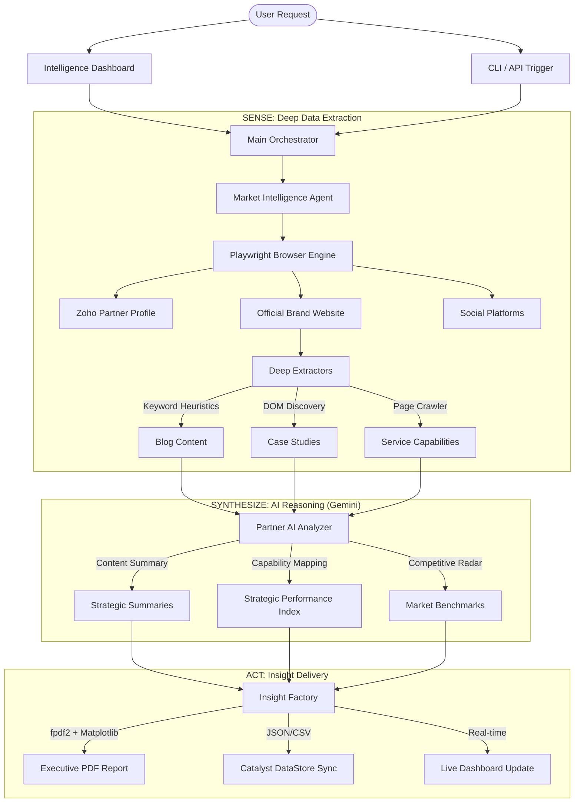

# 🤖 ScrapperAgent — Zoho Partner Strategic Intelligence

A premium, enterprise-grade competitive intelligence engine designed to scrape, analyze, and benchmark the Zoho Partner ecosystem. By combining **Playwright-driven deep extraction** with **Google Gemini 2.5 Flash Reasoning**, ScrapperAgent generates boardroom-ready executive reports and real-time performance indices.

---

## 🏗️ Intelligence Pipeline & Workflow

The system follows a modular "Search-SENSE-Synthesize" architecture to transform raw web data into actionable market intelligence.



---

## 🧩 Modular Architecture

The engine is built on a decoupled framework that separates raw data orchestration from AI synthesis:

| Module | Purpose | Core Logic |
| :--- | :--- | :--- |
| **`dashboard.py`** | **The Strategic Hub** | Flask-based web command center. Manages real-time status, competitor mapping, and report visual links. |
| **`main.py`** | **The Orchestration Core** | Primary CLI entry point. Coordinates high-level workflows (Scrape, Sync, or Report Generation). |
| **`agent.py`** | **The Navigator** | Manages the Playwright browser lifecycle. Implements "human-like" navigation patterns and SSL bypasses. |
| **`extractors.py`**| **Deep Scraper Intelligence** | Complex DOM analysis. Strips "noise" (nav, footers) to extract high-value text using keyword heuristics. |
| **`analyzer.py`** | **The AI Brain** | Translates raw text into intelligence via **Google Gemini**. Powers the Strategic Reasoning and Gap Analysis layers. |
| **`storage.py`**  | **The Insight Factory** | Handles data persistence, SPI calculation (Numerical Benchmarking), and complex PDF rendering with Matplotlib. |

---

## 📊 Strategic Performance Index (SPI)

ScrapperAgent quantifies market authority on a **0-100 scale** using a weighted multi-dimensional index:

*   **Technical Depth (40 pts)**: Calculated via blog volume, content sophistication, and technical keyword density.
*   **Customer Success (45 pts)**: Measured by the density and quality of verified Case Studies and Customer Stories.
*   **Market Authority (15 pts)**: Based on cross-platform social media footprint (LinkedIn, X, Instagram, Facebook).

---

## 🚀 Key Innovations

### 🧠 AI-Driven Discovery
Uses LLMs to "find" hidden Blog and Case Study listing pages that traditional scrapers miss due to complex menus or shadow DOMs.

### 🔄 Relationship-Aware Discovery
The system understands the **Parent-Competitor hierarchy**.
*   **Logical Nesting**: Automatically organizes data into `Parent > Competitors > Sub-Company` structures.
*   **360° Reports**: Analyzing a single competitor automatically pulls in its Parent and Peers for a complete market context.

### 🛡️ Bot Resilience
Implemented "Human Handshake" navigation flows to bypass firewall blocks and net-aborted errors, ensuring high-fidelity extraction from enterprise websites.

---

## 📖 Report Analysis Methodology

The **Executive Strategic Report** is a 10-section deep dive into a company's market position:

| Section | Basis of Analysis | Framework |
| :--- | :--- | :--- |
| **Executive Summary** | Full Content Synthesis | **Battle Framing**: Identifies market leaders and challengers. |
| **Scoring Matrix** | Asset Counts + AI Audit | **Weighted SPI**: Tech (30%), Proof (25%), Reach (20%), Trust (15%). |
| **GTM Strategy** | Service Delivery Models | **Comparative Analysis**: Channel strategy and ecosystem leverage. |
| **Strategic Radar** | Capability Intersection | **Radar Charts**: Visualizes the "shape" of market presence. |
| **Gap Analysis** | Delta Calculation | **Vulnerability Audit**: Where the baseline is losing friction. |
| **Strategic Roadmap**| Backwards-Induction | **Growth Modeling**: 12-month actionable path (Q1-Q4). |

---

## 🛠️ Quick Start

### 1. Installation
```bash
pip install -r requirements.txt
playwright install chromium
```

### 2. Configuration
Create a `.env` file:
```env
GEMINI_API_KEY=your_gemini_key_here
```

### 3. Launch
**Visual Dashboard**:
```bash
python dashboard.py
```
**CLI Power User**:
```bash
python main.py --partner "Partner Name"   # Targeted Scrape
python main.py --sync                     # Bulk Sync Ecosystem
python main.py --bulk                     # Generate Full Strategic Report
```

---

## ☁️ Cloud Infrastructure Sync

The system is fully integrated with **Zoho Catalyst** for enterprise-scale data persistence and cloud access.

*   **Stratus Storage**: All generated PDF reports and scraped artifacts are automatically synced to Zoho Stratus buckets.
*   **Catalyst DataStore**: Structured intelligence (scores, summaries, company profiles) is pushed to a relational DataStore for access by other enterprise applications.
*   **Automated Backups**: Local data is periodically mirrored to the cloud to ensure zero data loss.

---

## 🚀 Cloud Deployment (Zoho Appsail)

ScrapperAgent is container-ready and pre-configured for **Zoho Appsail** deployment.

### 🐳 Docker Integration
The project includes a production-ready Docker configuration. You can pull the latest image or build your own:
```bash
docker pull vaibhavsaini709/scrapper-agent-v2:latest
```

### ⚡ Deploy to Catalyst
Use the Catalyst CLI to deploy the engine to the cloud:
```bash
catalyst deploy
```
*Note: Ensure your `catalyst.json` is configured with the correct `PROJECT_ID` and environment variables.*

---

## 📡 Remote API & Synchronization

ScrapperAgent can push intelligence to remote databases in real-time via webhooks.

**Example Payload**:
```json
{
  "partner_id": "ext_9bef40659b58",
  "name": "Accenture",
  "relationship": {
    "type": "competitor",
    "parent_company": "Wipro",
    "folder_path": "Wipro/competitors/Accenture"
  },
  "scores": { "tech": 85, "success": 90, "authority": 70 }
}
```

---
*Created with ❤️ by the Intelligence Engineering Team.*
